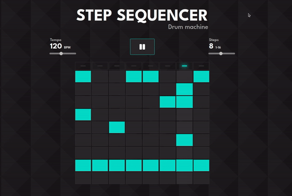

# step-sequencer-js

A drum machine step-sequencer build with ReactJS



## Installation

```sh
git clone https://github.com/shubhamkumaR630/step-sequencer-js.git
cd step-sequencer-js
npm install
```

### [Demo](https://drum-step-sequencer.netlify.app/):

Access this project at https://drum-step-sequencer.netlify.app/

### Features

- Variable sequence length
- Variable tempo
- 9 different drum sound effects (boom, clap, hihat, kick, openhat, ride, snare, tink, tom)

### License

This project is licensed under the MIT License - see the LICENSE file for details.
